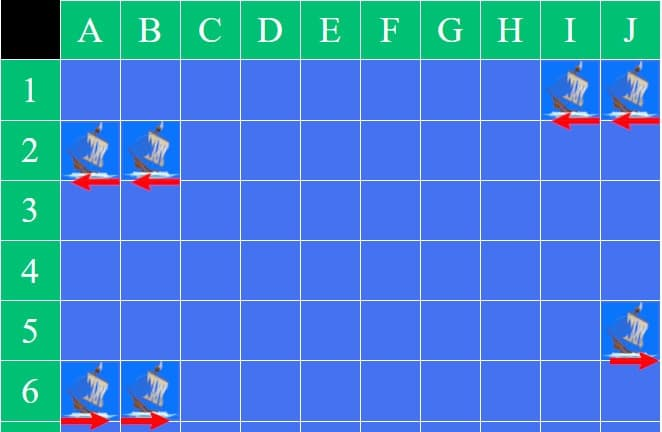
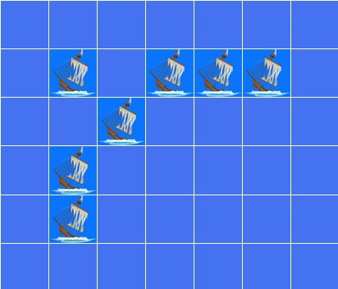
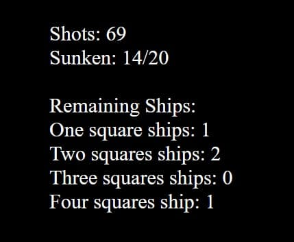

# Battleships

Stack: HTML, CSS, JavaScript  
Status: działający  
Demo: https://mikel538.github.io/Ships-Game/

Educational JavaScript project based on the classic Battleships game.

Welcome to the Battleships game! In this exciting challenge, you'll encounter four different types of ships:

- Four single-cell ships.
- Three two-cell ships.
- Two three-cell ships.
- One formidable four-cell ship.

Your mission is to strategically sink all of these ships.

## Gameplay

Click a cell on the board to shoot - it's either a hit or a miss. When you sink a ship, you'll get a pop-up notification. Keep an eye on the remaining ships next to the board.

### Board Layout

In this game, longer ships may extend horizontally and wrap around the edges of the board, similar to how the Earth appears spherical. This means that when a ship is longer than the available space in a row, the remaining part of the ship will continue from the opposite side of the board.

### Game Modes

In normal and hardcore modes, ships cannot appear in cells directly adjacent to the sides of other ships (left and right) or in cells above or below them. However, ships are allowed to spawn in corner cells.

### Ship Sinking

When you sink a whole ship, a pop-up confirmation triggers, and the remaining ships count updates.

## Play the Game

You can play the game by following this link: [Battleships Game](https://mikel538.github.io/Ships-Game/)

## Project Goals
- practice JavaScript game logic
- working with arrays and conditions
- handling user interactions (click events)
- simple state management

## What I Learned
- implementing turn-based logic
- validating user input
- basic game architecture in vanilla JavaScript
